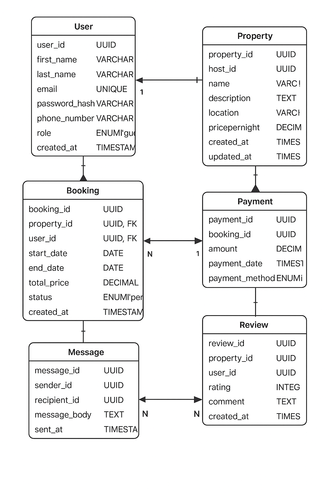

# Entity-Relationship Diagram (ERD) for ALX Airbnb Database

## **Entities and Attributes**

### **User**
- **user_id**: UUID (Primary Key, Indexed)
- first_name: VARCHAR, NOT NULL
- last_name: VARCHAR, NOT NULL
- email: VARCHAR, UNIQUE, NOT NULL
- password_hash: VARCHAR, NOT NULL
- phone_number: VARCHAR, NULL
- role: ENUM('guest', 'host', 'admin'), NOT NULL
- created_at: TIMESTAMP, DEFAULT CURRENT_TIMESTAMP

### **Property**
- **property_id**: UUID (Primary Key, Indexed)
- host_id: UUID (Foreign Key → User.user_id)
- name: VARCHAR, NOT NULL
- description: TEXT, NOT NULL
- location: VARCHAR, NOT NULL
- pricepernight: DECIMAL(10,2), NOT NULL
- created_at: TIMESTAMP, DEFAULT CURRENT_TIMESTAMP
- updated_at: TIMESTAMP, ON UPDATE CURRENT_TIMESTAMP

### **Booking**
- **booking_id**: UUID (Primary Key, Indexed)
- property_id: UUID (Foreign Key → Property.property_id)
- user_id: UUID (Foreign Key → User.user_id)
- start_date: DATE, NOT NULL
- end_date: DATE, NOT NULL
- total_price: DECIMAL(10,2), NOT NULL
- status: ENUM('pending', 'confirmed', 'canceled'), NOT NULL
- created_at: TIMESTAMP, DEFAULT CURRENT_TIMESTAMP

### **Payment**
- **payment_id**: UUID (Primary Key, Indexed)
- booking_id: UUID (Foreign Key → Booking.booking_id)
- amount: DECIMAL(10,2), NOT NULL
- payment_date: TIMESTAMP, DEFAULT CURRENT_TIMESTAMP
- payment_method: ENUM('credit_card', 'paypal', 'stripe'), NOT NULL

### **Review**
- **review_id**: UUID (Primary Key, Indexed)
- property_id: UUID (Foreign Key → Property.property_id)
- user_id: UUID (Foreign Key → User.user_id)
- rating: INTEGER CHECK (rating BETWEEN 1 AND 5), NOT NULL
- comment: TEXT, NOT NULL
- created_at: TIMESTAMP, DEFAULT CURRENT_TIMESTAMP

### **Message**
- **message_id**: UUID (Primary Key, Indexed)
- sender_id: UUID (Foreign Key → User.user_id)
- recipient_id: UUID (Foreign Key → User.user_id)
- message_body: TEXT, NOT NULL
- sent_at: TIMESTAMP, DEFAULT CURRENT_TIMESTAMP

---

## **Relationships**
- **User → Property**: 1:N (One host can have many properties)
- **User → Booking**: 1:N (One guest can make many bookings)
- **Property → Booking**: 1:N (One property can have many bookings)
- **Booking → Payment**: 1:1 (Each booking has one payment)
- **User → Review**: 1:N (One user can leave many reviews)
- **Property → Review**: 1:N (One property can have many reviews)
- **User → Message**: M:N (Users can message each other)

---

## **ER Diagram**

